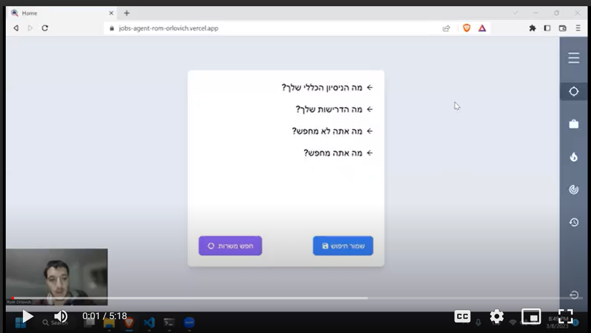
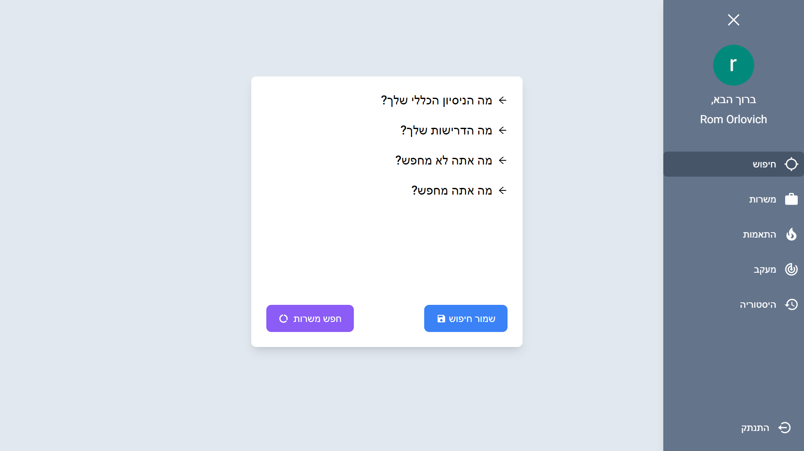
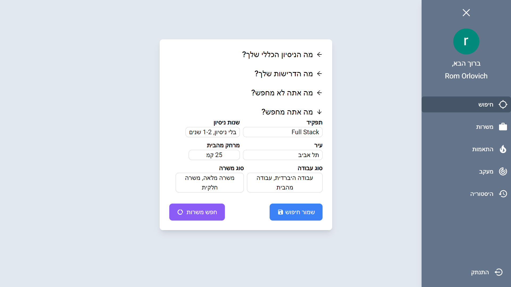
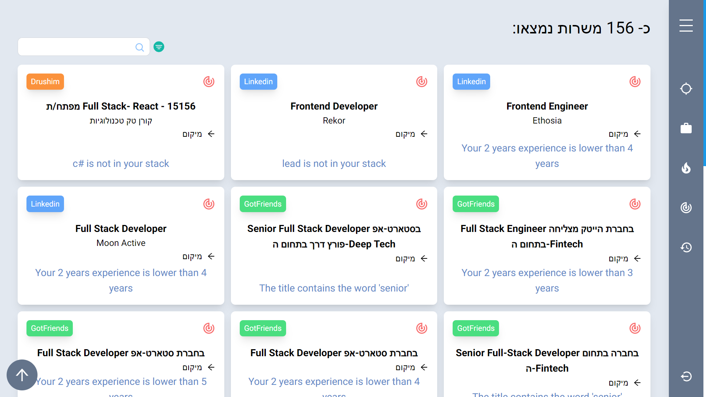
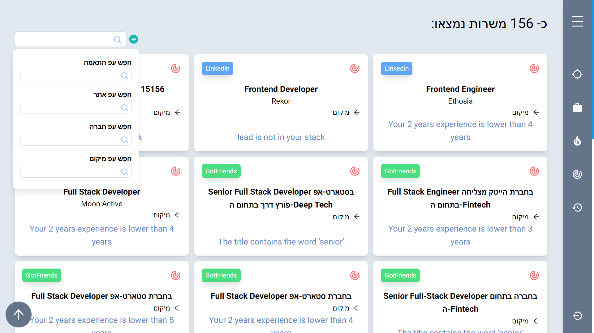
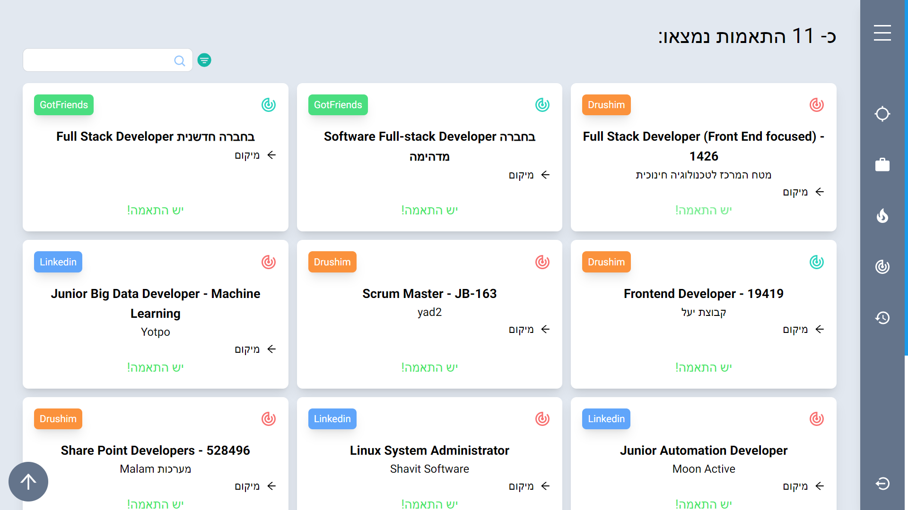
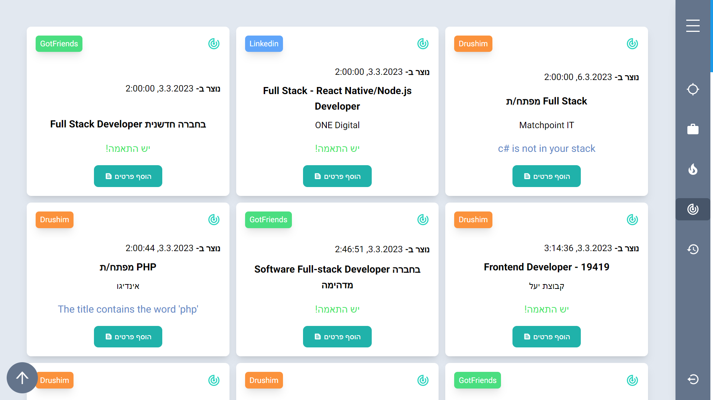
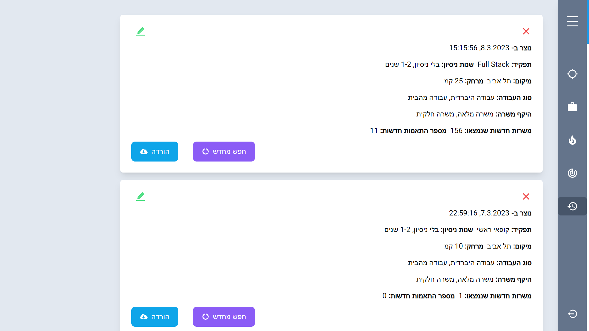

# Jobs Agent Frontend:

[Jobs Agent App](https://jobs-agent-rom-orlovich.vercel.app) :point_left:

[Jobs Agent Backend](https://github.com/rom-orlovich/jobs-agent-backend) :point_left:

## About My Project:

The Jobs Agent is a web application designed to help job seekers efficiently search for their next job across multiple online sources that provide job listings.
Traditional job searches can be time-consuming and involve sifting through hundreds of irrelevant job listings.

The Jobs Agent addresses this issue by allowing users to fill out their profiles with relevant search queries and using them to scan various job listing sites
to retrieve all relevant job listings in one place.
The system enables users to filter job listings that match their requirements, making the job search process more streamlined and efficient.

This repository contains the frontend part of the Jobs Agent project.
The frontend part is responsible for displaying the UI of job data, improving the search and filter process for a more user-friendly experience, and enabling users to track their job search process in the jobs they send their CV.


[<p align="center">
</p>](https://drive.google.com/file/d/1H6pV3lnnpqHT1Szd8eSQT_KZcr7ehqsM/view?usp=sharing "How to use? click me!")


# Table of contents
- [**How To Use?**](#how-to-use)
- [**Main Features**](#main-features)
- [**Technologies**](#technologies)
- [**Packages**](#packages)
- [**How It Works?**](#how-it-works)
  - [User Profile Creation](#user-profile-creation)
  - [Getting the Results](#getting-the-results)
  - [Tracking Jobs](#tracking-jobs)
  - [Search History](#search-history)
- [**Installation**](#installation)
- [**What's next?**](#whats-next)
- [**Images**](#images)


## How To Use? 


[<p align="center"></p>](https://drive.google.com/file/d/1H6pV3lnnpqHT1Szd8eSQT_KZcr7ehqsM/view?usp=sharing "How to use?")


## Main Features:


- **Users System** :
- Users can log in with their Google account and create their private user account.
- The user can create a profile that contains the user's job preferences, which the backend algorithm uses to identify which jobs fit the user's profile.
- The user can create search queries with criteria for searching jobs in the jobs listing sites.
- **Job Display** - The application displays the founded jobs, and the user can scroll down to load more jobs.
- **Filtering** - The application enables the filtering of the displayed jobs according to job title, location, the site of the jobs, company, and suitability level.
- **Matching Page** - The page only displays jobs matching the user's profile.
- **Tracking Page** :
  - Each job post has a track button that the user can click to save the job post in their profile.
  - The tracking job posts display on the Tracking page.
  - In the Tracking page, the user can click on the "Add Info" button to add information on how the job search process is progressing after the user sends their CV to the job.
- **Search History** :
- The Search History page displays the user's search history.
- The user can quickly get the results from his history searches.
- The user can edit these queries and create a new query based on them.
- The user can also delete old queries and download the data of those old queries if the data exists.

## Technologies:

- [Next.js](https://nextjs.org/)- A React-based framework used for building server-side rendered and optimized web applications
- [TypeScript](https://www.typescriptlang.org/) - For type checking and improved developer productivity.
- [MongoDB](https://www.mongodb.com/) - A NoSQL database that stores users' account data.

## Packages:

- [React](https://reactjs.org/) - A JavaScript library for building user interfaces.
- [SWR](https://swr.vercel.app/) - For fetching data and caching the client's response, used to improve the application's performance.
- [Axios ](https://axios-http.com/docs/intro) - For making API requests to the backend.
- [Next-Auth](https://next-auth.js.org/getting-started/example) - An authentication library for Next.js applications for authenticating users with their Google accounts.
- [Tailwind CSS](https://tailwindcss.com/) - A utility-first CSS framework used for styling the application's user interface.
- [HeadlessUI/React ](https://headlessui.com/) - A collection of accessible UI components for React used for building the user interface of the application
- [React-Toastify](https://fkhadra.github.io/react-toastify/introduction/) -For displaying toast messages in the application.
- [use-debounce](https://www.npmjs.com/package/use-debounce) - To improve the search and filter process by debouncing user inputs.
- [React-Icons](https://react-icons.github.io/react-icons/search) - For displaying icons in the application.
- [http-proxy-middleware](https://www.npmjs.com/package/http-proxy-middleware) -For proxying HTTPS TO HTTP requests to my backend API.
- [ESLint](https://eslint.org/) - For linting tool for identifying and reporting on patterns in JavaScript code, used for maintaining code quality.
- [Prettier](https://prettier.io/) - Ensuring code style and formatting consistency across the project.
- [Husky](https://www.npmjs.com/package/husky) - For git hooks manager that runs scripts before git commands.
- [Lint-staged](https://www.npmjs.com/package/lint-staged) - For running linters against staged git files, used for maintaining code quality.

## How It Works?:

### User Profile Creation:

- The user logs in with their Google account and fills out their overall years of experience, job requirements, and excluded requirements.
- The information the user enters is saved in the database and used by the matching algorithm to filter job postings.
- The more specific the user's profile, the better the algorithm performs.

### Getting the Results:

- After clicking the load scanner button, the backend scanner scans various job listing sites for jobs matching the user's search criteria.
- The results are displayed on the "Jobs" page, where the user can filter the jobs further or go to the Matching page to see jobs that match their profile.

### Tracking Jobs:

- If the user finds a job they've already applied for, they can track it by clicking the red track icon button on the job posting.
- In the Tracking page, users can add additional information on the job application process and see their tracked job postings.

### Search History:

- Users can access their search history to edit, delete, and load previous searches.
- Users can download the data as a CSV file if job postings are associated with a previous search.

## Installation

1. **Clone the repo**
   ```
   git clone git@github.com:rom-orlovich/jobs-agent-backend.git
   ```
2. **Install all the dependencies**
   ```
   npm run ci
   ```
3. **Create .env.local with the following variables**:
   ```
   MONGO_DB_URI= <Your MONGO_DB_URI>
   GOOGLE_CLIENT_ID =  <Your GOOGLE_CLIENT_ID>
   GOOGLE_CLIENT_SECRET = <Your GOOGLE_CLIENT_SECRET>
   NEXTAUTH_URL = <Your NEXTAUTH_URL>
   ```
4. **Run Client**

   ```
   npm run dev
   ```

5. **Go to http://localhost:3000 and have fun**!

## What's next?:

1. **Implement end-to-end testing with Cypress** - to ensure that the system functions correctly and all features are working as expected.
2. **Style improvements** - Refining the UI to ensure a clean and intuitive experience for users.
3. **New features on demand** - Use user feedback to improve the system. If you have a feature request, please let us know and we'll do our best to consider it for future development.

## Images:

### User Profile

   
   

### Jobs Page

   
   
   
### Jobs Match Page
   
   
   
### Jobs Tracking Page
   
   
   
   
### Search History Page
   
   
